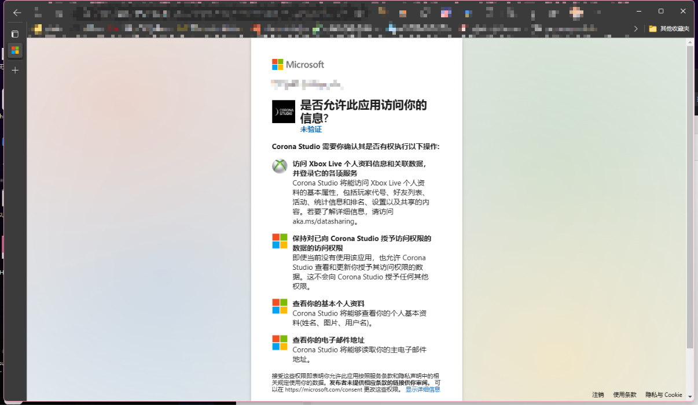
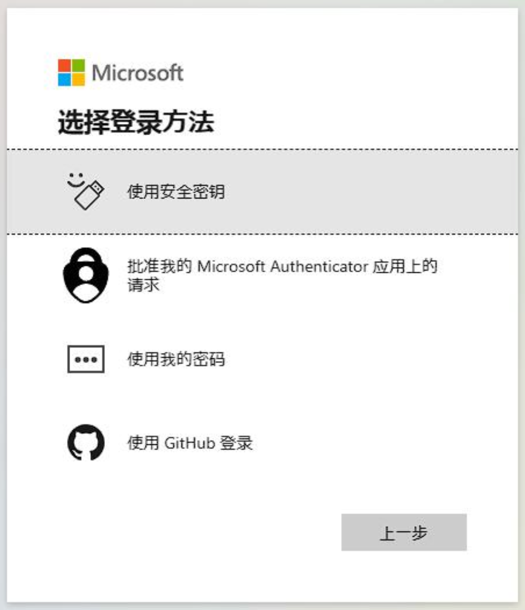
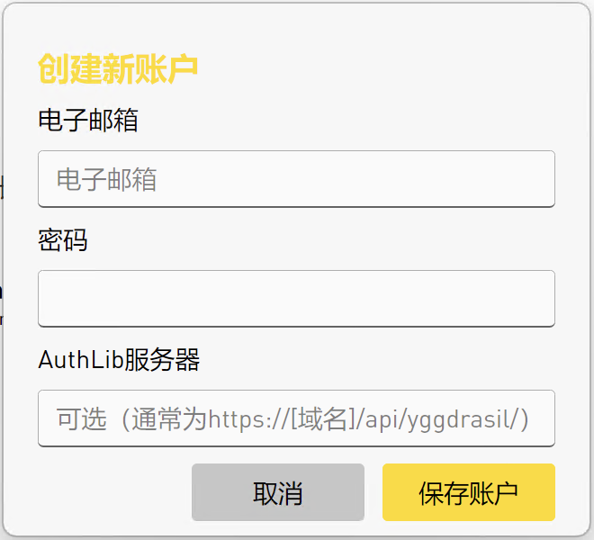

# Add a game account to LauncherX

[[toc]]

Edited date: February 27, 2023 | Feiron Iguista | Japerz

## Preface

In this guide, we recommend that you prioritize using an official Microsoft account to log in to your Minecraft. Although the official has not made clear its opposition to games without genuine verification such as offline mode, we still recommend that you support and maintain intellectual property rights by purchasing Minecraft. **Using an offline copy of Minecraft may result in infringement, so all consequences will be borne by you and LauncherX is not responsible for it.**

This article will guide you in using LauncherX to add **Local Only** game accounts during initial use and subsequent use, including the following types:

- Microsoft Account
- Offline Mode Account
- AuthLib Account(Original Mojang account login)

*Since the official has stopped supporting Mojang accounts and started migrating Mojang accounts to Microsoft accounts, LauncherX will no longer support Mojang account login. For More Details: [Mojang Java Edition Minecraft Account Move | Minecraft](https://help.minecraft.net/hc/en-us/articles/19615552270221)*

## Initial Setup

When you use LauncherX for the first time, you will see LauncherX greet you and ask you to perform some initial settings necessary to use LauncherX. When you reach the "Add Account" step, you can choose one of the following operations. Click the "Add" button to get started.

### Microsoft Acount Login

Click the "Microsoft Account" button in the pop-up window, LauncherX will pop up another window (verification information window) containing a verification link, a one-time verification code and some buttons.

<!-- 这个截图需要在Lx完全更新英文版本后更新 -->

The entire process takes about 10 seconds to complete (this may take a little longer depending on network performance and whether your browser saves your Microsoft account login information).
Taking into account Microsoft's privacy policy, we recommend that you complete this process within 3 minutes to avoid invalidation of the one-time verification code. If the one-time code fails, you need to close the current verification information window and repeat the operation of adding a Microsoft account.

- Click "Copy Code" to copy the one-time code you need to use for this login to the clipboard. *[[Microsoft]Clipboard in Windows](https://support.microsoft.com/en-us/windows/clipboard-in-windows-c436501e-985d-1c8d-97ea-fe46ddf338c6)*
- Click "Open Verification Page" to open the Microsoft account verification page through your default browser.
- Paste the one-time code you copied into the specified location as prompted on the web page. If Microsoft requires you to log in, please log in to your Microsoft account on the web page first.
- After this window pops up, you need to "agree" to continue adding the account.

While LauncherX is verifying your account, you can continue with the next step of setup.

If you think the verification process is too slow or failing, consider optimizing your current network environment (for example, using an accelerator for Xbox login or trying to move closer to your wireless network source, if you are using one.)

#### Unexpected situation: Edge browser pops up requiring security verification device:

For this case, you need:

  - Hit "Cancel"
  - Click "Other login methods" on the web page, as shown in the figure:
  - Click "Use my password" or choose any login method that's convenient for you: 

### Offline Mode

This is arguably the easiest way to add an account. You can use LauncherX to enable custom skins for your local game. This feature will only take effect on your local client. See: Game Account Management/Skin Preview
**But I still want to remind you that using the offline version may be illegal and result in legal consequences, and you will be responsible for all the consequences.**

- Click "Offline Account"
- Enter any player name you want. Note that some versions (especially older versions) do not support non-English and English character IDs.
- Offline mode only allows you to play local games and servers that support offline login.

### AuthLib

Use a special login verification service with the help of [AuthLib-Injector](https://github.com/yushijinhun/authlib-injector). Before choosing this option to log in, you should confirm that you have an AuthLib external login service from one party.

To do this, you need to prepare:

- External login verification email
- Corresponding password
- The AuthLib server address corresponding to the authentication service (this is necessary for external logins, because LauncherX does not know whose Yggdrasil API you need to authenticate to. Typically, this address is something like "https://<service provider's domain name>/api/yggdrasil”)"

Click "External Login" to get started.

- A window as shown in the picture will pop up: 
- Enter the information you should have prepared previously
- Save account. This information will be encrypted and used as credentials, which will be used for verification after you log in to the server that supports the corresponding AuthLib service.

## More setup

After completing the initial setup, you can enter **Settings-Account** to add more game accounts.

After clicking "Add Account", everything is exactly the same as when you first set up LauncherX. We recommend that you add an offline account with the same ID after adding a Microsoft account to avoid the problem that some games cannot be started when online or not.
