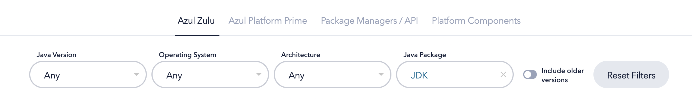

# Special settings for Linux

[[toc]]

## For Linux distributions based on ARM64 architecture

::: warning

Because Mojang has not officially supported ARM64 versions of Linux games.
Therefore, you need to manually download and install the JRE runtime before using LauncherX.

:::

### Download and install the JRE runtime

Here we're gonna use [Azul JDK](https://www.azul.com/downloads/#zulu) to demonstrate JRE installation process. 

At [Azul JDK Website](https://www.azul.com/downloads/#zulu) , scroll down a little to see the JDK version filter box:

At **Operating System**, select **Linux**, and at **Architecture**, select **ARM 64-bit**
to get get all available JDK versions.

Clike the **Download** button on the right-side bar, and select **.tar.gz** formate JDK runtime, and after downloading, extract it to any local folder.
Then select **Add Manually** in LauncherX and select the **java** executable file in the **bin/** directory of the JDK folder.

## If it can't run

You might need to do the following:

- Open a new terminal, or use the one that just appeared
- Enter `export LC_CTYPE=en_US.UTF-8`, and hit enter
- (If necessary, the above steps can be performed with administrator privileges [sudo])
- Try running again. If that fails, try re-login the system.
- If it fails again, be sure to give us feedback at [LXIT (GitHub)](https://github.com/Corona-Studio/LXIT).
