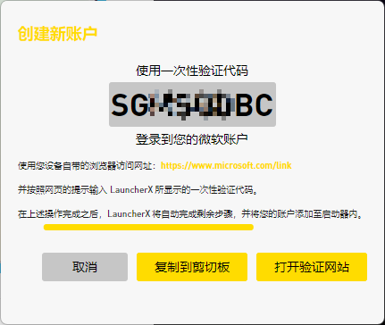
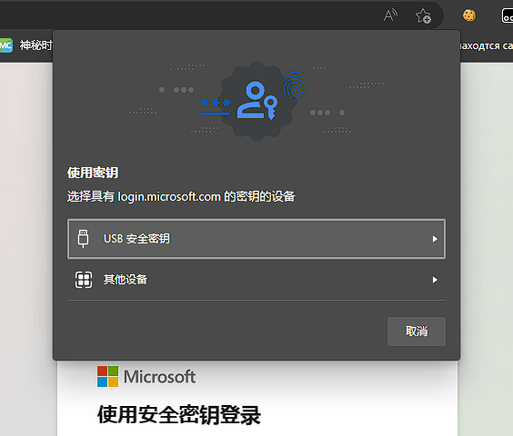
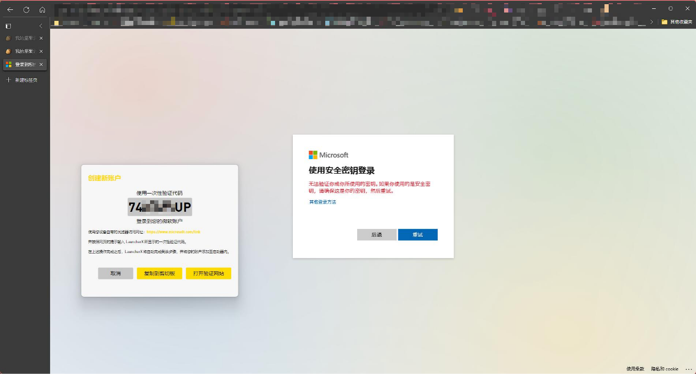

# 使用LauncherX添加游戏账户

/*对本地化贡献者的提示: 请将本文中的链接替换为对应的本地化. 这句话只应该在简体中文(中国大陆)中出现。* /

编辑日期: 2023年2月27日 | Feiron Iguista

[[toc]]

## 前言

在这篇文章中,我们建议您优先使用来自微软官方的Microsoft帐户登录您的Minecraft。虽然官方并未明确其对离线模式等无正版验证的游戏的反对态度, 但我们仍然建议您通过购买Minecraft来支持和维护知识产权.

本文将指导您使用LauncherX在初次使用和后续使用中添加**仅本地可用的**游戏账户, 包括以下类型:

- Microsoft帐户
- 离线模式帐户
- AuthLib帐户（原Mojang账户登录）

*由于官方已经停止对Mojang帐户的支持并开始迁移Mojang帐户到Microsoft帐户, 故LauncherX将不再支持Mojang帐户登录。详情: [Mojang Java 版 Minecraft 帐户移动 | Minecraft](https://www.minecraft.net/zh-hans/mojang-account-move)*

## 初次设置

初次使用LauncherX时, 您会看到LauncherX在向您打招呼之后要求您进行一些使用LauncherX必要的初始设置。在到达“添加账户”这一步时, 您可以选择以下一个操作进行。点击“添加”按钮来开始.

### Microsoft帐户登录

点击弹出窗口中的“Microsoft帐户”按钮, LauncherX将会弹出一个包含验证链接、一次性验证代码和些许按钮的置顶窗口 ( 验证信息窗口 ).

整个流程大约10秒即可完成 (受网络性能和您的浏览器是否保存了您的微软账户登录信息影响, 这可能会有些许延长) , 考虑到微软的隐私策略, 我们建议您在3分钟内完成这个流程, 以免一次性验证代码失效。若一次性代码失效, 您需要关闭当前的验证信息窗口并重复添加微软账户的操作.

- 点击“复制代码”, 即可把您本次登录所需要使用的一次性代码复制到剪贴板。*[[Microsoft]Windows10+内置剪贴板提示](https://support.microsoft.com/zh-cn/windows/%E5%89%AA%E8%B4%B4%E6%9D%BFwindows-c436501e-985d-1c8d-97ea-fe46ddf338c6)*

- 点击“打开验证页面”, 将会通过您的默认浏览器打开微软账户的验证页面.

- 将您复制的一次性代码按网页提示粘贴到指定的位置。如果微软要求您登录, 请先在网页中登录您的微软账户.

- 弹出此窗口后, 您需要“同意”以继续添加账户的操作.

  

  在LauncherX验证账户过程中, 您可以继续进行下一步设置。

  如果您认为验证过程太慢或失败, 请考虑优化您当前的网络环境 (比如, 使用针对Xbox登录的加速器或尝试离您的无线网络源近一些, 如果您在使用的无线网络的话。) 

  

  ##### 意外情况: Edge浏览器弹出需要安全验证设备:

  如图所示:

  

  ​	对于这种情况, 您需要:

  - 点击“取消”
  - 在网页中点击“其他登录方法”,如图:
  - 点击“使用我的密码”, 或者选择任意您方便使用的登录方法.

### 离线模式

这可以说是最简单的账户添加方法。您可以用LauncherX为您的本地游戏开启自定义皮肤, 这个功能只会对您的本地客户端生效。 参见: 游戏账户管理/皮肤预览

- 点击“离线账户”
- 输入任意您想要的玩家名。注意, 有些版本 ( 尤其是较老的版本 ) 不支持中文ID。
- 离线模式只能供您游玩本地游戏和支持离线登入的服务器。

### AuthLib

/*在临台版本的LauncherX中, 添加账户选单中仍然显示的是Mojang登录。*/

借助Authlib-Injector, 使用特殊的登录验证服务。在选择这一项登录之前, 您应该确认您有来自某一方的AuthLib外置登录服务。

为此, 您需要准备:

- 外置登录验证电子邮箱
- 对应的密码
- 对应验证服务的AuthLib服务器地址 (这对于外置登录是必须的, 因为LauncherX不知道您需要向谁的Yggdrasil API进行验证。通常, 这个地址类似“https://<服务提供商的域名>/api/yggdrasil”)

点击“外置登录”以开始。

- 弹出如图所示的窗口:

- 对应输入先前您应该准备好的信息
- 保存账户。这些信息将加密后作为凭证, 在您登录支持对应的AuthLib服务的服务器后用于验证。

## 后续添加

在完成初次设置后, 您可以进入**设置-帐户**, 添加更多的游戏账户。

点击“添加账户”之后, 一切操作与您在初次设置LauncherX时候完全一致。我们建议您在添加了微软账户后对应的添加一个相同ID的离线账户, 以避免部分游戏在联网或未联网情况下无法启动的问题。
