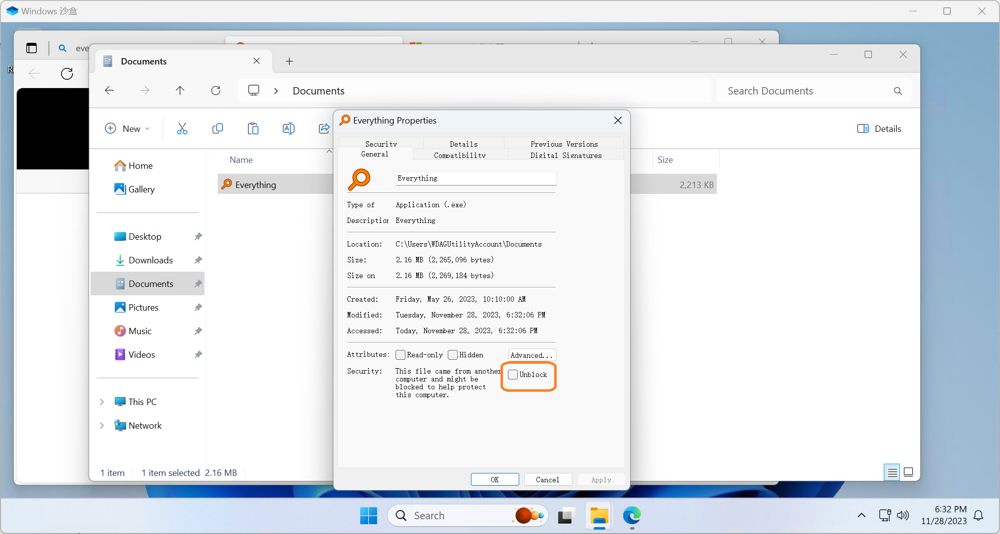

# 针对 Windows 系统的特殊设置

::: warning

请注意， LauncherX  **不支持** Windows7以下版本的操作系统，以及任意一个版本的Windows S。

:::

目前，您不需要进行任何额外配置即可使用  LauncherX  启动器的全部功能。

…但是您可能会遇到一些意外，如图所示：

类似于这样的弹窗——会要求您先在Microsoft Store下载安装“供任务执行的程序”，或者由 SmartScreen 弹出的“警示安全风险”的提示弹窗：

请将其关闭，并且执行以下步骤（或者允许，跳过后续步骤并再次尝试启动 LauncherX）：

1. 右键单击您的 LauncherX 可执行文件
2. 点击`“属性”`
3. 找到如图中标记出的勾选框并将其勾选: （图片中借用`Everything`刚从网上下载时的“属性”窗口为示范。）
4. 点击`“应用”`，然后关闭`“属性”`窗口。
5. 尝试启动 LauncherX 。如果仍然无法工作，请[与我们取得联系](/zhCN/guide/contact)

::: warning

如果在尝试启动 LauncherX 时候出现了来自其他安全类软件的警告，那么您需要允许 LauncherX 运行以使用 LauncherX 。若您对 LauncherX 持有怀疑，可以前往[VirusTotal](https://www.virustotal.com)这种权威的线上沙盒并将您下载的 LauncherX 副本上传检测。

:::